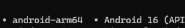
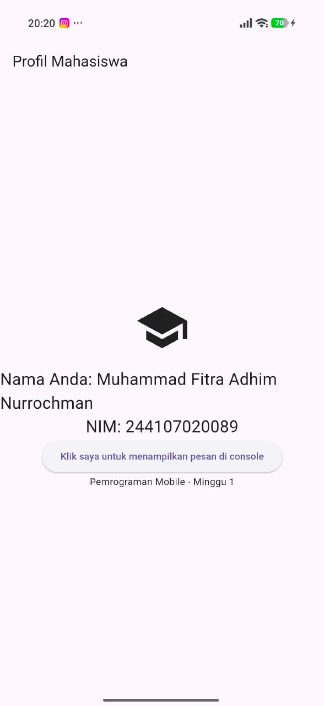

# Week 01 - Mobile Development Ecosystem and Flutter Refresh

Praktikum sudah sangat bisa diselesaikan dengan mantab dan mendapatkan hasil yang bagus sesuai arahan dan instruksi.

# Checklist verifikasi
1. semua masalah sudah terselesaikan
2. sudah mendeteksi device

3. aplikasi berjalan mulus sudah ada di folder screenshot
4. hot reload :memasukkan perubahan kode tanpa biasanya menghapus state; gunakan untuk iterasi UI.
hot restart : menjalankan ulang aplikasi dari awal sehingga state hilang; gunakan ketika perubahan tidak dapat diterapkan melalui hot reload, misalnya inisialisasi aplikasi.
5. sudah aman

# Mini assignment
Buat aplikasi Profil Mahasiswa berdasarkan praktikum. Tambahkan NIM dan satu informasi tambahan menggunakan widget dasar. Push hasil ke repository portfolio sesuai struktur yang ditentukan. Sertakan screenshot dan penjelasan singkat atas satu kendala setup yang Anda temui.

itu saya tambahkan NIM dan widget sederhana yaitu elevatedbutton

jadi awalnya error saat menambahkan elevatedbutton yang bisa menampilkan pesan di terminal saat di klik, lalu saya mencoba beberapa kali dan nihil. lalu akhirnya saya menggunakan AI untuk membantu debug, ternyata masalahnya ada pada body: const center, saat const dihapus maka error nya hilang.

# Refleksi
1. menurut saya native lebih tepat dipilih saat hanya ingin fokus pada satu platform saja misalnya untuk game mobile contohnya seperti mobile legends yang mana tidak bisa dimainkan di desktop

2. dalam pola deklaratif, tampilan antarmuka disajikan sebagai fungsi dari data state.
ketika perubahan state terjadi maka flutter akan mengeksekusi ulang fungsi pada bagian widget tree yang relevan.
widget tree baru dibentuk untuk merepresentasikan kondisi data terbaru.
dan flutter membandingkan widget tree baru dengan struktur di blaik layar, lalu secara efisien memperbarui tampilan visual pada layar sesuai perubabhan tersebut.

3. menurut saya commit kecil dengan pesan jelas sangat bermanfaat jika misalnya saat kita bekerja dan ingin melihat atau me review kode, lalu bisa juga untuk melacak bug dan bisa lebih efisien dalam debugging, kalau untuk portfolio menurut sya itu mencerminkan standar kerja profesional seperti misalnya HRD atau yang akan me rekrut kita tidak hanya melihat hasil akhir website atau aplikasi yang kita buat akan tetapi juga alur berpikir kita sebagai developer melalui commit history pada repository proyek kita