# Week 02 - Declarative UI and Responsive Design
PRAKTIKUM
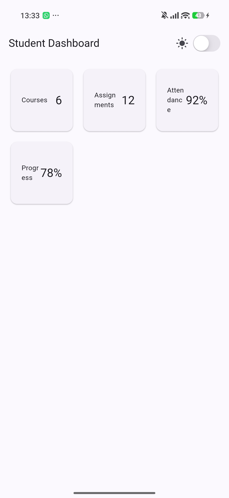

TUGAS UTAMA

LIGHT MODE
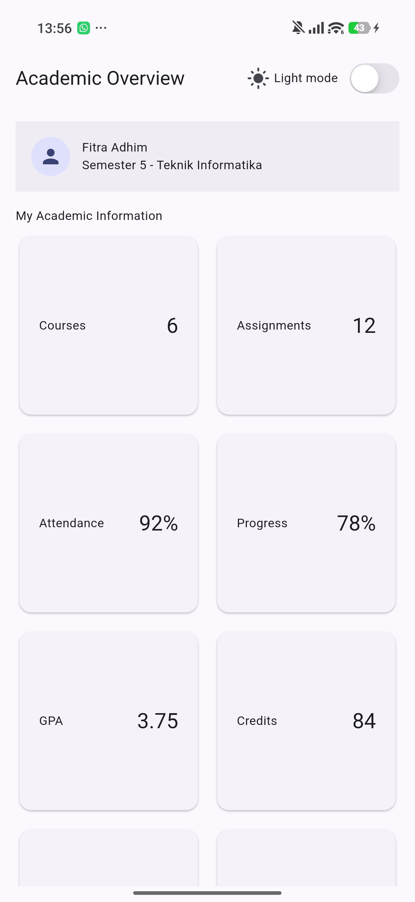
DARK MODE
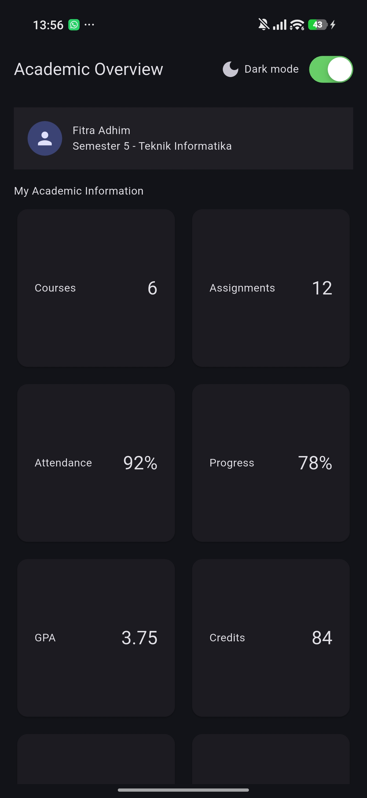

Dokumentasi AI

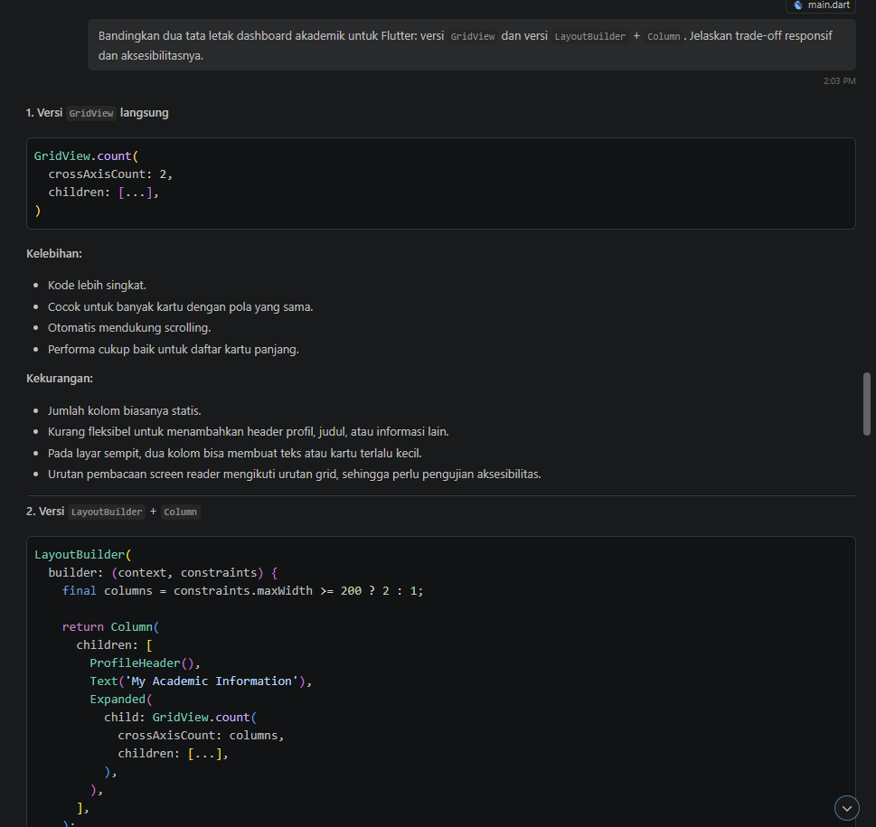

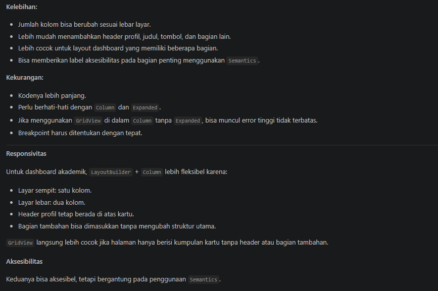

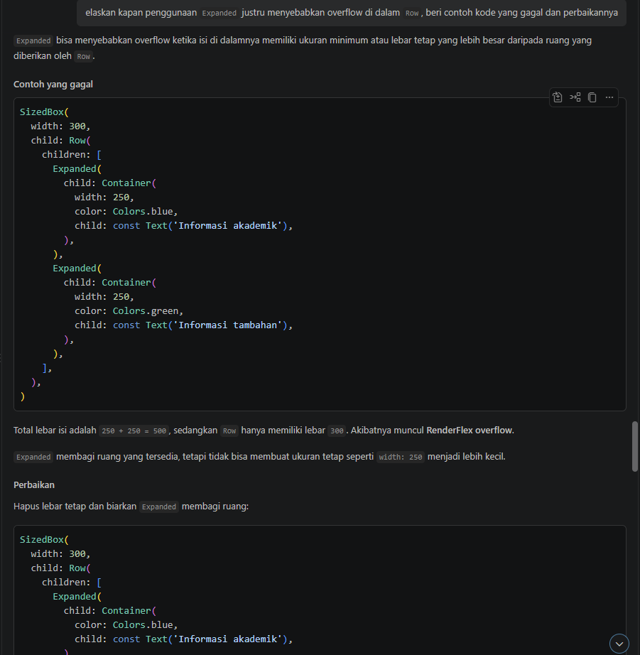

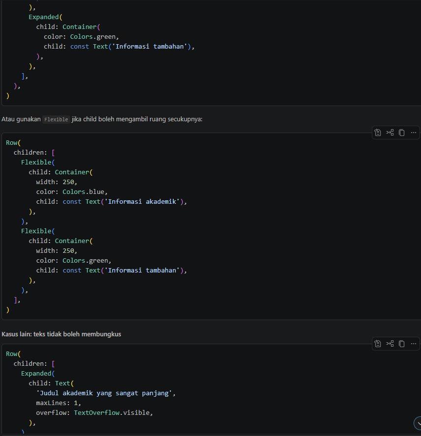

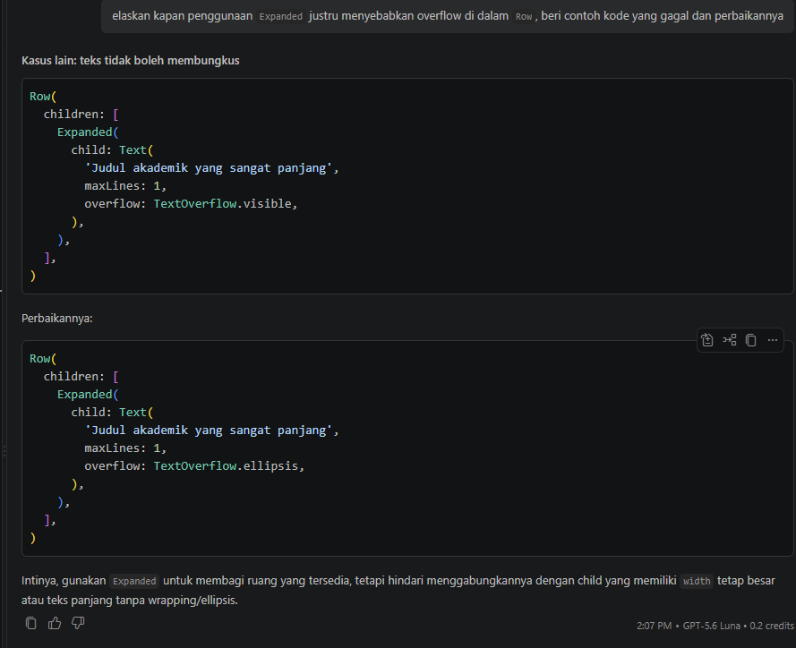

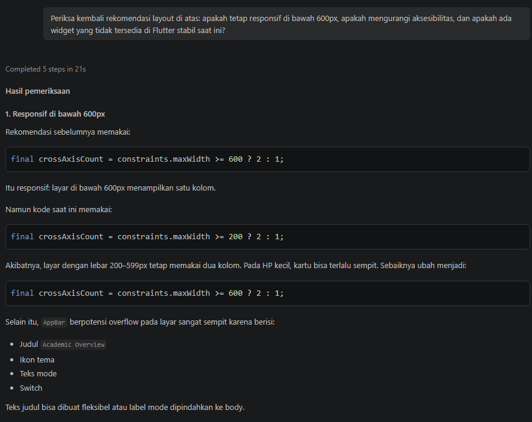

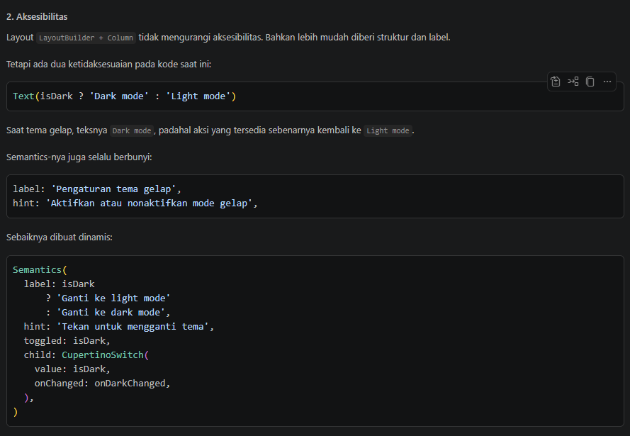

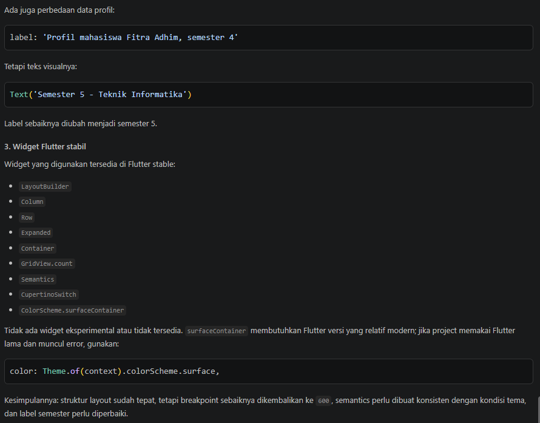

REFACTORING CHALLENGE

commit

TESTING DASAR

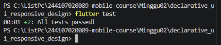

CHECKLIST VERIFIKASI
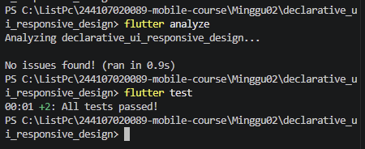
dapat berjalan di layar sempit dan lebar
kontras warna dark mode bagus, teks dapat terbaca jelas
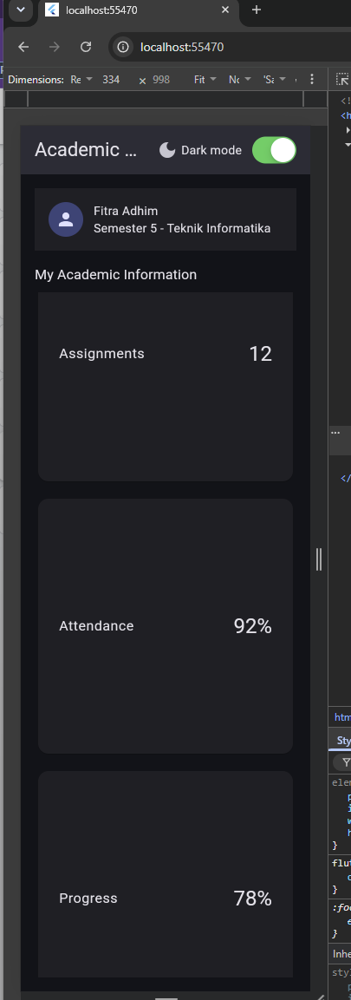
insyaallah bisa menjelaskan saat code review

REFLEKSI DAN REFERENSI

1. Apa perbedaan cara berpikir imperative dan declarative saat membangun UI?
2. Kapan Expanded membantu dan kapan penggunaannya justru menghasilkan layout error?
3. Bagaimana breakpoint dan theme memengaruhi pengalaman pengguna?
4. Apa yang Anda verifikasi dari rekomendasi AI setelah tugas inti selesai?

1. **Imperative** menjelaskan langkah-langkah untuk mengubah UI, misalnya mencari widget lalu mengubah nilainya satu per satu. **Declarative** menjelaskan kondisi UI yang diinginkan berdasarkan state. Pada Flutter, widget dibangun kembali sesuai nilai state, contohnya ketika `isDark` berubah maka `themeMode` dan tampilan ikut berubah.

2. `Expanded` membantu membagi ruang kosong yang tersedia di dalam `Row`, `Column`, atau `Flex`. Contohnya, `Expanded` pada judul kartu membuat teks mengambil ruang yang tersisa setelah nilai angka. Layout error dapat terjadi jika `Expanded` digunakan di dalam parent dengan ukuran tidak terbatas, seperti `Column` di dalam `ScrollView` tanpa batas tinggi, atau jika child memiliki ukuran minimum yang lebih besar dari ruang yang tersedia. Akibatnya dapat muncul error seperti `RenderFlex overflow` atau `unbounded height`.

3. Breakpoint menentukan kapan layout berubah mengikuti ukuran layar. Pada dashboard ini, lebar kurang dari `700` pixel menggunakan satu kolom, sedangkan layar yang lebih lebar menggunakan dua kolom. Hal ini membuat kartu lebih mudah dibaca di layar sempit dan informasi lebih efisien di layar lebar. Theme mengatur warna dan tampilan light/dark mode sehingga aplikasi tetap nyaman digunakan pada kondisi pencahayaan berbeda. Saya juga menggunakan `Theme.of(context)` dan label `Semantics` agar warna serta informasi aksesibilitas mengikuti kondisi tema.

4. Setelah tugas inti selesai, saya memverifikasi bahwa layout dapat menampilkan satu kolom pada layar sempit dan dua kolom pada layar lebar. Saya juga memeriksa toggle light/dark mode, keterbacaan teks, label aksesibilitas, dan penggunaan widget yang tersedia di Flutter. Selain itu, saya menjalankan `flutter analyze` untuk memastikan tidak ada error atau warning dan `flutter test` untuk memastikan widget test responsif berhasil.