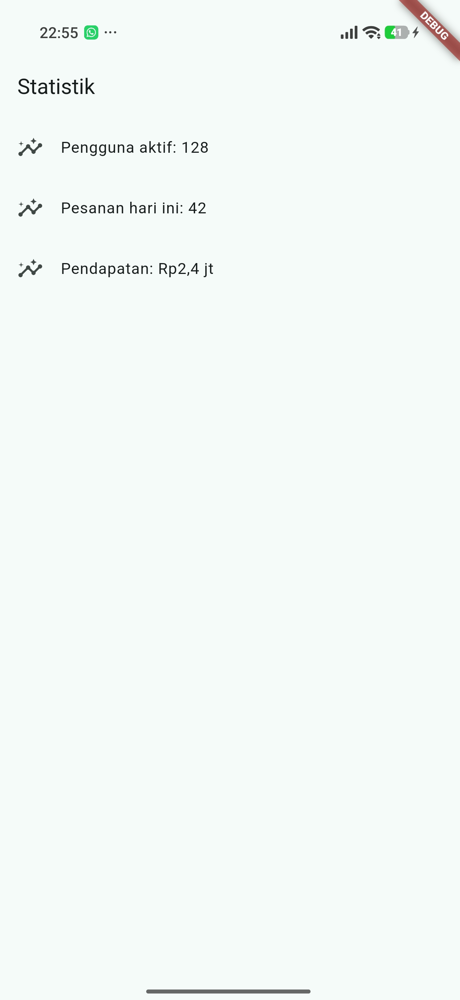
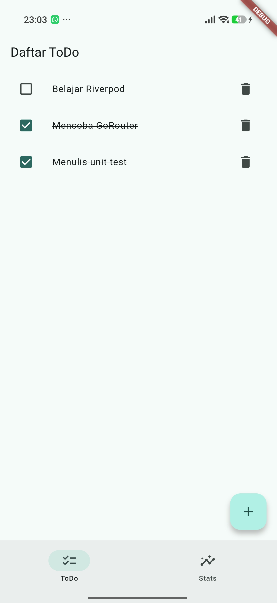
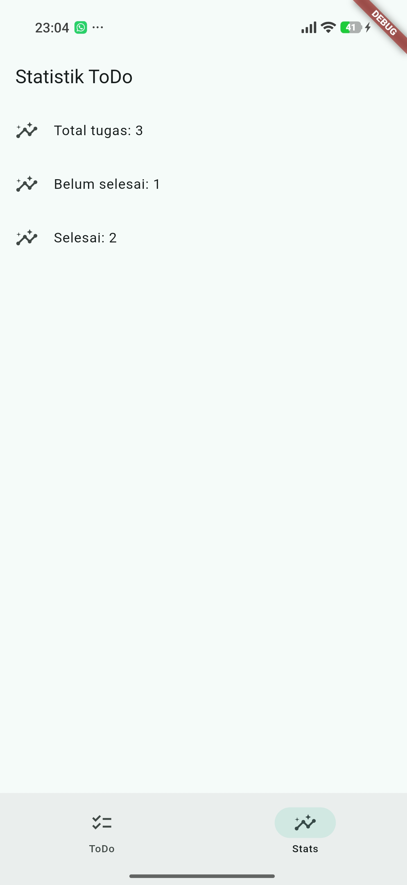

# Week 03 - Navigation and State Management

PRAKTIKUM 1

PRAKTIKUM 2

PRAKTIKUM 3
1. 
2. 
dipencet tidak ada reaksi apa apa
3. 
sukses
4. menampilkan data lama dengan indikator refresh lebih baik karena pengguna tetap dapat melihat infotmasi yang sudah tersedia saat data terbaru sefang dimuat. layar tidak menjadi kosong, sehingga aplikasi terasa lebih cepat dan pengguna tidak kehilangan konteks

AI PROMPT CHALLENGE

AI Verification Checklist
1. Apakah state diubah secara immutable (tidak ada state.add() atau mutasi list langsung)?
2. Apakah ref.watch hanya dipakai di dalam build, dan ref.read di callback?
3. Apakah ketiga state AsyncValue benar-benar ditangani (bukan hanya success)?
4. Apakah provider dideklarasikan dengan tipe eksplisit dan tidak duplikat dengan provider lain?
5. Apakah kode AI memakai API Riverpod versi lama (StateProvider antipattern, StateNotifierProvider usang, atau Consumer bertingkat yang tidak perlu)? Perbaiki ke pola Notifier/ConsumerWidget.
6. Jalankan flutter analyze dan flutter test, apakah hasil AI lolos tanpa warning?

jawaban
1. Iya, state sudah diubah secara immutable. Pada kode tidak ada state.add() atau list yang diubah langsung. Kalau ingin mengubah data, dibuat list baru terlebih dahulu, jadi data sebelumnya tidak dirusak.

2. Iya, ref.watch dipakai di dalam method build pada StatsPage untuk memantau perubahan statsProvider. Untuk tombol retry digunakan ref.invalidate(statsProvider) di callback, jadi tidak memakai ref.watch di luar build.

3. Iya, ketiga state AsyncValue sudah ditangani dengan when. Saat loading tampil spinner, saat error tampil pesan error dan tombol Coba lagi, sedangkan saat success data statistik ditampilkan dalam ListView yang berisi tiga item.

4. Provider sudah ditulis dengan tipe yang jelas, yaitu AsyncNotifierProvider<StatsNotifier, List<String>>. Di project ini hanya ada satu provider untuk statistik, yaitu statsProvider, sehingga tidak ada provider yang duplikat.

5. Kode menggunakan API Riverpod yang lebih baru, yaitu AsyncNotifier dan ConsumerWidget. Tidak menggunakan StateProvider, StateNotifierProvider, atau Consumer bertingkat yang tidak diperlukan.

6. Hasil pemeriksaan tidak menemukan error. flutter analyze berhasil tanpa issue dan unit test notifier berhasil dengan hasil 2 test passed dan 0 failed.

REFACTORING DAN TESTING

Refactoring Challenge
1. Pisahkan widget bar ToDo menjadi TodoTile tersendiri agar build lebih pendek dan mudah diuji.
2. Ekstrak logika filter (misal tampilkan hanya yang belum selesai) menjadi Provider turunan yang membaca todoListProvider.
3. Integrasikan aplikasi ToDo dengan GoRouter: / untuk daftar dan /stats untuk halaman statistik, tambahkan NavigationBar untuk berpindah.

1. Widget baris Todo sudah dipisahkan menjadi TodoTile. Jadi TodoPage hanya mengatur daftar dan callback, sedangkan tampilan satu tugas diatur oleh TodoTile. Menurut saya cara ini membuat build TodoPage lebih pendek dan widget TodoTile juga lebih mudah untuk diuji sendiri.

2. Logika filter sudah dibuat menjadi incompleteTodosProvider. Provider ini membaca todoListProvider menggunakan ref.watch, lalu mengambil Todo yang done-nya masih false. Dengan begitu, logika filter tidak ditulis langsung di dalam tampilan halaman.

3. Aplikasi sudah menggunakan GoRouter dengan dua route, yaitu / untuk halaman daftar Todo dan /stats untuk halaman statistik. NavigationBar diletakkan di AppShell sehingga bisa digunakan untuk berpindah antara halaman ToDo dan halaman Stats tanpa membuat navigasi manual di setiap halaman.

Testing

flutter analyze dan test

Checklist verifikasi mandiri
- Navigasi GoRouter bekerja: pindah halaman, back, dan akses path detail langsung.
    1. sukses
- ProviderScope membungkus root aplikasi; state ToDo bertahan saat berpindah halaman.
    2. sukses 
- UI AsyncValue menangani loading, error, dan success, bukan hanya success.
    3. sukses
- flutter analyze tanpa issue dan semua test lulus.
    4. sukses
- Hasil AI diverifikasi dan didokumentasikan pada folder docs/.
    5. sukses

TUGAS, REFLEKSI, DAN REFERENSI

Mini project
Bangun aplikasi ToDo dengan navigasi dan Riverpod sebagai tugas minggu ini:

- Minimal 2 halaman dengan GoRouter: daftar tugas, halaman detail/statistik.
    1. 
    2. 
- State dikelola Riverpod (Notifier), UI menggunakan ConsumerWidget.
    1. sukses
    2. 
    3. 
- Tambahkan fitur simulasi asinkron dengan AsyncValue: state loading, error, dan success tampil dengan benar.
    1. sukses
    2. 
- Sertakan minimal 1 unit/widget test yang lulus.
    1. sukses
- Kerjakan bagian AI Challenge dan dokumentasikan prompt, hasil AI, perbaikan, serta alasan keputusan teknis Anda.
    1. sukses flutter test
- Push ke repository portfolio pada folder 03-week-3-navigation-state-management/ dengan struktur lib/, test/, README.md, dan screenshots/. README menjelaskan tujuan, fitur utama, stack teknologi, cara menjalankan, dan hasil yang dicapai.

REFLEKSI

1. Kapan setState masih cukup, dan kapan state harus naik ke Riverpod?
2. Apa perbedaan context.go dan context.push, dan kapan masing-masing tepat digunakan?
3. Bagaimana AsyncValue mencegah bug dibanding tiga boolean terpisah?
4. Bagian mana dari hasil AI yang Anda perbaiki, dan mengapa?

Jawaban

1. Menurut saya, setState masih cukup untuk perubahan kecil yang hanya dipakai oleh satu halaman, misalnya membuka atau menutup tampilan. Kalau state dipakai oleh beberapa halaman atau perlu dikelola lebih teratur, state sebaiknya dinaikkan ke Riverpod.

2. context.go digunakan untuk pindah ke route tertentu dan mengganti route yang sedang aktif. context.push digunakan untuk menambahkan halaman baru ke stack, sehingga halaman sebelumnya masih bisa kembali dengan tombol back. Jadi context.go cocok untuk menu utama, sedangkan context.push cocok untuk halaman detail.

3. AsyncValue membuat state loading, error, dan success berada dalam satu state yang jelas. Dengan tiga boolean terpisah, bisa terjadi kombinasi yang tidak sesuai, misalnya isLoading dan hasError sama-sama true. AsyncValue membantu mengurangi kemungkinan bug seperti itu.

4. Bagian AI yang saya perbaiki adalah penggunaan provider, pemisahan TodoTile, filter Todo, dan penanganan state AsyncValue. Saya memperbaikinya supaya kode lebih rapi, state tidak dimutasi langsung, dan kondisi loading, error, serta success bisa terlihat dengan jelas.