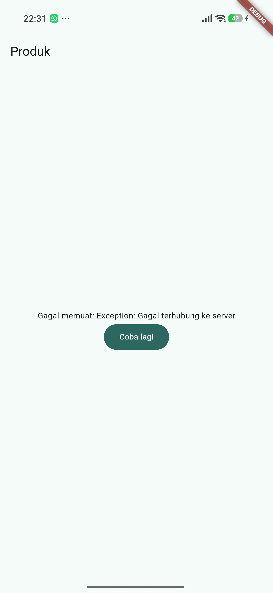
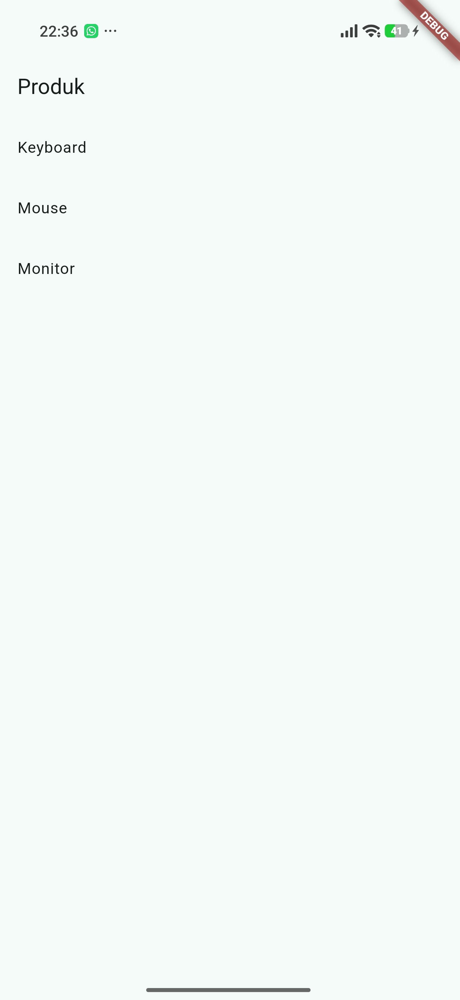

# Week 03 - Navigation and State Management

PRAKTIKUM 1

PRAKTIKUM 2

PRAKTIKUM 3
1. 
2. 
dipencet tidak ada reaksi apa apa
3. 
sukses
4. menampilkan data lama dengan indikator refresh lebih baik karena pengguna tetap dapat melihat infotmasi yang sudah tersedia saat data terbaru sefang dimuat. layar tidak menjadi kosong, sehingga aplikasi terasa lebih cepat dan pengguna tidak kehilangan konteks