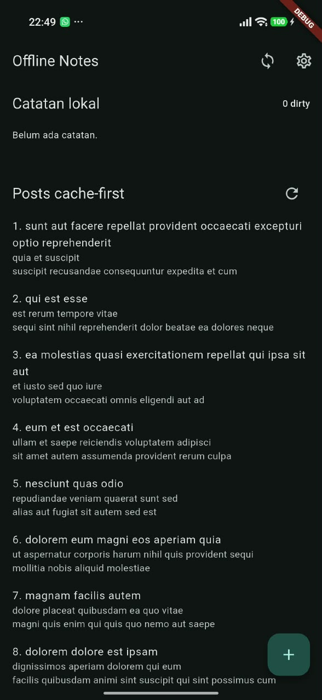
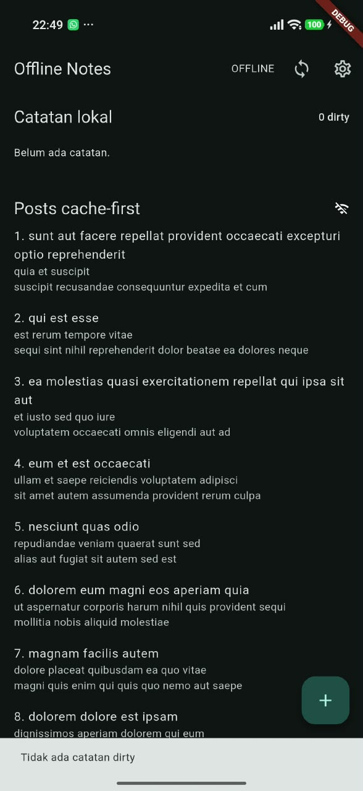
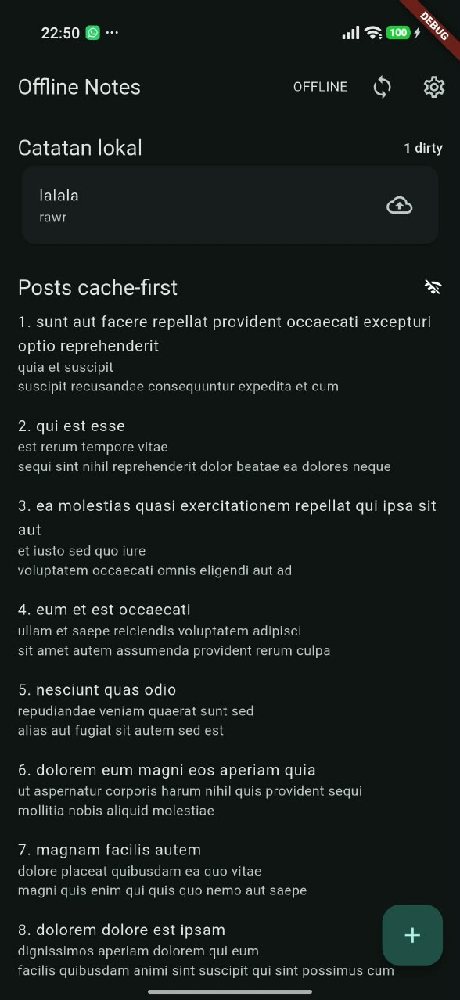
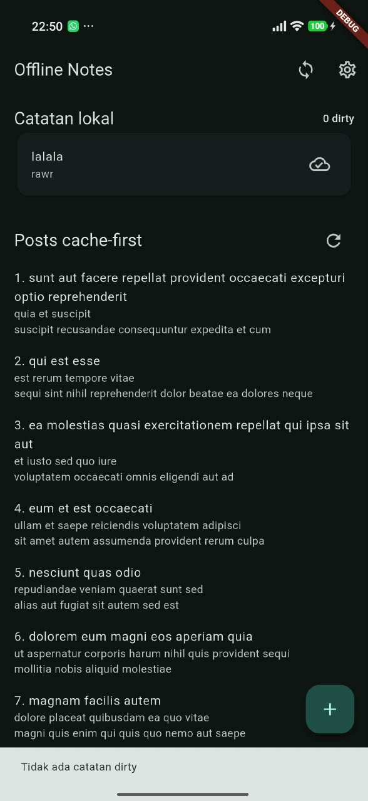

# Week 05 - Local Storage and Offline First

## Praktikum Cache-First dan Sinkronisasi Data

### Tujuan

Praktikum ini bertujuan untuk menguji penyimpanan data lokal dan mekanisme
offline-first pada aplikasi Flutter. Data posts ditampilkan dari cache lokal
terlebih dahulu, sedangkan catatan baru disimpan secara lokal dengan status
`dirty` sampai dilakukan sinkronisasi.

### Skenario Pengujian

#### 1. Kondisi awal

Pada kondisi awal, aplikasi menampilkan halaman **Offline Notes**. Belum ada
catatan lokal sehingga badge menunjukkan `0 dirty`. Data posts berhasil
ditampilkan pada bagian **Posts cache-first**.



#### 2. Mengaktifkan force offline

Mode `Force offline` diaktifkan melalui halaman Settings. Aplikasi menampilkan
label **OFFLINE**, tetapi data posts yang sebelumnya tersimpan di cache tetap
tersedia dan dapat dibaca tanpa koneksi jaringan. Badge catatan tetap akurat
sebesar `0 dirty`.



#### 3. Menambahkan catatan dirty

Sebuah catatan baru dengan judul `lalala` dan isi `rawr` ditambahkan ketika
mode offline aktif. Catatan langsung tersimpan pada database lokal dan dapat
ditampilkan kembali. Karena belum disinkronkan ke server, badge berubah menjadi
`1 dirty` dan ikon cloud menunjukkan status belum tersinkron.



#### 4. Sinkronisasi catatan

Mode offline dimatikan dan sinkronisasi dijalankan menggunakan tombol sync.
Setelah proses selesai, badge kembali menjadi `0 dirty`. Ikon cloud pada
catatan berubah menjadi status tersinkron, sehingga catatan tetap tersedia di
database lokal dengan status bersih.



### Hasil Pengamatan

| Tahap | Kondisi aplikasi | Hasil |
| --- | --- | --- |
| 1 | Online, belum ada catatan | Posts tampil dan badge `0 dirty` |
| 2 | `Force offline` aktif | Cache posts tetap dapat dibaca tanpa jaringan |
| 3 | Catatan baru dibuat offline | Catatan tersimpan lokal dan badge menjadi `1 dirty` |
| 4 | Sinkronisasi dijalankan | Badge kembali menjadi `0 dirty` dan catatan berstatus tersinkron |

### Kesimpulan

Implementasi berhasil menerapkan konsep offline-first. Data yang sudah pernah
di-cache tetap dapat ditampilkan ketika aplikasi berada dalam mode offline.
Catatan baru juga tidak hilang karena langsung disimpan ke database lokal dan
diberi penanda `dirty`. Setelah koneksi tersedia kembali, proses sinkronisasi
mengubah status catatan menjadi bersih (`0 dirty`).

## Analisis Pilihan Local Storage

Aplikasi memiliki dua jenis data yang berbeda:

- **Preferensi tema** dan `forceOffline` adalah beberapa nilai sederhana berupa
	boolean/string.
- **Catatan** adalah data berulang yang dapat berjumlah 1000 atau lebih dan
	membutuhkan pencarian, pengurutan, pagination, serta status `dirty`.

### Perbandingan Teknologi

| Teknologi | Kompleksitas query | Relasi | Reaktivitas (stream) | Type-safety | Boilerplate | Kemudahan testing | Trade-off utama |
| --- | --- | --- | --- | --- | --- | --- | --- |
| **SharedPreferences** | Sangat terbatas: key-value sederhana | Tidak cocok | Tidak ada stream database bawaan | Rendah; nilai dibaca berdasarkan tipe runtime | Paling kecil | Sangat mudah untuk di-mock | Ringan dan cepat untuk preferensi, tetapi tidak cocok untuk daftar catatan atau query 1000+ data |
| **Hive** | Baik untuk lookup dan filter sederhana, tetapi bukan SQL | Terbatas; relasi harus dikelola aplikasi | Ada listener/`ValueListenable`, tetapi tidak sefleksibel query stream | Sedang; adapter dan model perlu dijaga konsistensinya | Kecil sampai sedang | Mudah dengan box sementara/test adapter | Cepat dan sederhana, tetapi query kompleks, relasi, migrasi, dan pagination perlu lebih banyak logika manual |
| **sqflite (SQLite)** | Sangat baik; SQL, `WHERE`, `JOIN`, index, transaksi, pagination | Sangat baik | Tidak bawaan; perlu invalidasi provider atau wrapper stream | Sedang-rendah; hasil query berupa map dan raw SQL tidak dikompilasi | Sedang | Baik dengan database in-memory/mock dan fixture SQL | Matang dan fleksibel, tetapi mapping model, migrasi, dan query harus ditulis manual |
| **Drift** | Sangat baik; mendukung SQL dan query terkomposisi | Sangat baik | Sangat baik; query dapat menghasilkan stream reaktif | Tinggi; tabel, row, query, dan hasil dibuat type-safe | Sedang sampai besar karena code generation | Sangat baik; mendukung database test dan query terisolasi | Pilihan paling lengkap untuk aplikasi catatan, tetapi build runner, generated code, dan learning curve menambah setup |

### Rekomendasi Final

| Kebutuhan | Rekomendasi | Alasan |
| --- | --- | --- |
| Preferensi tema, `forceOffline`, dan nilai aplikasi kecil | **SharedPreferences** | Data hanya berupa key-value sederhana, tidak membutuhkan relasi, query, stream, atau pagination. Boilerplate dan biaya testing paling kecil. |
| Catatan 1000+ item dengan pencarian, sorting, status `dirty`, dan kemungkinan relasi | **Drift** | Menyediakan SQLite, query type-safe, stream reaktif, transaksi, index, dan dukungan testing yang baik. Perubahan catatan dapat langsung mengalir ke UI tanpa invalidasi manual. |
| Catatan jika ukuran aplikasi dan setup harus minimal | **sqflite** | Tetap memakai SQLite yang kuat dan cocok untuk 1000+ catatan. Pilihan ini lebih sederhana daripada Drift, tetapi mapping, query, dan reaktivitas harus dikelola manual. |

Untuk aplikasi pada praktikum ini, `SharedPreferences` sudah tepat untuk
preferensi. Implementasi saat ini memakai `sqflite` untuk catatan karena cukup
untuk kebutuhan CRUD, cache, status `dirty`, dan sinkronisasi. Jika fitur
pencarian, filter, relasi, dan update real-time bertambah, migrasi ke **Drift**
akan menjadi pilihan yang lebih aman untuk jangka panjang.

### Skema Data untuk 1000+ Catatan

Berikut skema minimal yang dapat digunakan pada SQLite maupun Drift. Satu baris
mewakili satu catatan, sedangkan index membantu pencarian dan pengurutan tanpa
memindai seluruh tabel.

```text
+---------------------------+
| notes                     |
+---------------------------+
| id          INTEGER  PK   |
| title       TEXT NOT NULL |
| body        TEXT          |
| updated_at  TEXT NOT NULL |
| dirty       INTEGER       |
+---------------------------+
					|
					| optional, jika catatan memiliki label
					v
+---------------------------+       +---------------------------+
| note_tags                 |       | tags                      |
+---------------------------+       +---------------------------+
| note_id     INTEGER  FK   |------>| id          INTEGER  PK   |
| tag_id      INTEGER  FK   |       | name        TEXT UNIQUE   |
+---------------------------+       +---------------------------+

Index yang disarankan:
- INDEX notes_updated_at_idx ON notes(updated_at DESC)
- INDEX notes_dirty_idx ON notes(dirty)
- INDEX note_tags_note_id_idx ON note_tags(note_id)
- INDEX note_tags_tag_id_idx ON note_tags(tag_id)
```

Untuk 1000+ catatan, daftar tidak sebaiknya dimuat sekaligus. Gunakan
pagination, misalnya `LIMIT 50 OFFSET n` atau cursor berdasarkan `updated_at`
dan `id`. Query umum yang diperlukan adalah:

```sql
SELECT id, title, body, updated_at, dirty
FROM notes
ORDER BY updated_at DESC, id DESC
LIMIT 50;
```

Catatan baru atau catatan yang diedit diberi `dirty = 1`. Proses sinkronisasi
memproses baris dirty dalam transaksi, lalu mengubahnya menjadi `dirty = 0`
setelah server mengonfirmasi keberhasilan. Dengan aturan ini, kegagalan
jaringan tidak menghapus data lokal dan catatan dapat dicoba sinkronisasi
kembali.
