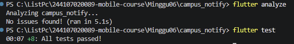

# Week 06 - Authentication, Security, and FCM

# Praktikum 2


.jpeg>)

# Praktikum 3

.jpeg>)


# AI Challenge: Verifikasi FCM dan Refactoring

## Prompt AI Challenge

```text
Aplikasi Flutter Campus Notification App.
Stack: firebase_messaging, flutter_local_notifications,
flutter_secure_storage, go_router, Riverpod.
Buatkan PushService dengan:
- requestPermission + getToken + onTokenRefresh (kirim ke POST /devices)
- onMessage (tampilkan local notification manual)
- onMessageOpenedApp + getInitialMessage (navigasi ke data.route)
- subscribe/unsubscribe topic pengumuman-kampus
- background handler top-level dengan @pragma('vm:entry-point')
Tandai bagian yang BERBEDA untuk Android 13+ vs iOS,
dan bagian yang tidak boleh mengakses BuildContext.
```

## Output awal yang ditinjau

Draf awal memiliki handler background top-level, `getToken`,
`onTokenRefresh`, callback navigasi FCM, local notification foreground, dan
subscribe topic. Draf awal belum sepenuhnya memenuhi prompt/checklist:

- Belum memiliki fungsi unsubscribe topic.
- Local notification foreground hanya mengisi detail Android.
- Platform registrasi token ditulis tetap sebagai `android`.
- Error POST token diabaikan tanpa diagnostik.
- Handler klik/route belum bisa dibuktikan berjalan hanya dari pembacaan kode.

Contoh bentuk awal alur listener:

```dart
FirebaseMessaging.onMessage.listen((message) async {
  await showForegroundNotification(message);
});

FirebaseMessaging.onMessageOpenedApp.listen((message) {
  onRoute(routeFromMessage(message.data));
});
```

## Perbaikan manual dan refactoring

- Handler background tetap top-level dan memakai
  `@pragma('vm:entry-point')`. Handler hanya menginisialisasi Firebase;
  `BuildContext`, router, dan Riverpod tidak boleh diakses dari isolate
  background.
- Foreground menampilkan local notification manual dengan route dari payload.
  Detail Android dan iOS disediakan; klik banner lokal diteruskan ke router.
- Klik notifikasi FCM background ditangani oleh `onMessageOpenedApp`, sedangkan
  startup dari notifikasi ditangani `getInitialMessage`.
- Route dan parser payload murni kini terpusat di `lib/routes.dart`.
  Parser menangani route hilang/kosong sebagai `/` dan menambahkan slash awal
  pada route relatif.
- Token awal dan token baru hasil `onTokenRefresh` dikirim ke `POST /devices`.
  Platform Android/iOS dikenali saat runtime. Log tidak memuat token penuh;
  kegagalan Dio mencatat jenis error dan status saja.
- Topic `pengumuman-kampus` memiliki fungsi subscribe dan unsubscribe. Topic
  dipakai untuk broadcast, bukan pesan personal.
- Error Dio dipetakan oleh `lib/data/api_errors.dart`; halaman login
  menampilkan pesan, bukan exception mentah.
- 401 memicu refresh lalu retry maksimal satu kali. Jika refresh gagal atau
  retry tetap 401, token dihapus dan provider auth diinvalidate agar router
  mengarahkan pengguna ke login.
- Android 13+ memerlukan izin notifikasi runtime dan channel Android. iOS
  meminta izin alert/badge/sound dan memerlukan konfigurasi Firebase/APNs yang
  valid untuk pengujian push.

## Checklist verifikasi kode

| Pemeriksaan | Temuan |
| --- | --- |
| Handler background top-level + `@pragma('vm:entry-point')` | Sesuai; tanpa `BuildContext`/Riverpod/router. |
| POST token awal dan token refresh | Keduanya memakai callback yang sama untuk POST `/devices`; keberhasilan backend belum diuji. |
| Foreground local notification manual | Sesuai, dengan payload route untuk navigasi saat banner ditekan. |
| Navigasi tiga app state | Handler tersedia; runtime di perangkat belum diuji. |
| Token/secret di-hardcode atau dicetak penuh | Tidak ditemukan pada alur ini; token debug dipotong dan tidak dicetak penuh. |
| Android 13+ dan iOS | Perbedaan izin/channel/detail platform tercakup; konfigurasi Firebase/APNs tetap diperlukan. |
| Route dipakai bersama GoRouter dan FCM | Konstanta dan parser di `lib/routes.dart`. |
| Error Dio ramah pengguna | Helper di `lib/data/api_errors.dart`; login UI menerima pesan ramah. |

## Bukti validasi

| Validasi | Perintah | Hasil |
| --- | --- | --- |
| Analisis Dart | `flutter analyze` | Lulus, exit code `0`, tanpa masalah. |
| Unit dan widget tests | `flutter test` | Lulus, exit code `0`; seluruh 8 test lulus, termasuk retry refresh sukses dan gagal. |
| Build APK Android debug | `flutter build apk --debug` | Lulus pada pemeriksaan sebelumnya; build melaporkan peringatan kompatibilitas Kotlin Gradle Plugin dependency `firebase_core`. |
| Emulator/perangkat | `flutter emulators`, `flutter devices` | Tidak ada emulator/perangkat Android; hanya Windows desktop, Chrome, dan Edge terdeteksi. |

Unit tests menggunakan fake dependency dan tidak menghubungi Firebase/backend.
Kelulusan analyze/test/build bukan bukti pesan FCM diterima, banner OS tampil,
atau deep link berjalan pada perangkat.

## Matriks uji perangkat

Gunakan pesan gabungan `notification` + `data`, dengan `route` bernilai
`/pengumuman/3`. Pengguna perlu sudah login agar guard router tidak
mengalihkannya ke halaman login.

| State | Cara uji | Hasil yang diharapkan | Hasil aktual |
| --- | --- | --- | --- |
| Foreground | Buka aplikasi, kirim pesan, ketuk banner lokal. | Banner lokal muncul dan membuka `/pengumuman/3`. | Belum diuji di perangkat. |
| Background | Tekan Home, kirim pesan, ketuk banner sistem. | Aplikasi membuka rute melalui `onMessageOpenedApp`. | Belum diuji di perangkat. |
| Terminated | Tutup aplikasi sepenuhnya, kirim pesan, ketuk banner sistem. | Aplikasi dibuka ke rute melalui `getInitialMessage`. | Belum diuji di perangkat. |

## Keputusan teknis

Pesan broadcast memakai gabungan `notification` dan `data`: OS menampilkan
notification saat background/terminated, sedangkan foreground memakai local
notification manual. Rute diparsing secara murni supaya logikanya dapat diuji
tanpa Firebase. Pengujian runtime FCM dan backend tetap harus dilakukan pada
perangkat nyata/emulator dengan konfigurasi Firebase yang benar.

# Refactoring, testing, dan error umum

# Checklist verifikasi mandiri
- Token hanya di flutter_secure_storage, tidak di SharedPreferences/log/screenshot penuh. <p>Selesai &#10003;</p>
- 401 memicu refresh sekali lalu retry; refresh mati memaksa login ulang. <p>Selesai &#10003;</p>
- Ketiga app state teruji dengan tabel bukti; klik masuk ke rute yang benar. <p>Selesai &#10003;</p>
- Topik untuk broadcast, token untuk pesan personal. <p>Selesai &#10003;</p>
- flutter analyze bersih dan semua test lulus.



# Tugas, refleksi, dan referensi

1. Mengapa refresh token tidak boleh disimpan di SharedPreferences? Apa risikonya bila bocor?
2. Apa yang rusak bila onTokenRefresh diabaikan selama satu semester perkuliahan?
3. Kapan memakai topik dan kapan memakai token perangkat? Beri contoh pesan kampus untuk masing-masing.
4. Bagian mana dari draf AI yang Anda tolak atau perbaiki, dan mengapa?

Jawaban:

1. SharedPreferences menyimpan data secara plain text (tanpa enkripsi) dan gampang diakses pada perangkat yang di-root. Jika refresh token bocor, peretas bisa terus-menerus meminta access token baru untuk mengambil alih akun pengguna secara permanen tanpa perlu tahu kata sandi.
2. Aplikasi tidak akan menerima pembaruan token FCM dari server. Dampaknya, pengiriman push notification ke pengguna akan gagal total (pengguna tidak akan menerima notifikasi apa pun) karena server kampus masih mengirimkan notifikasi ke token lama yang sudah kadaluarsa/tidak valid.
3. - Topik: Digunakan untuk pengumuman massal ke banyak pengguna sekaligus yang berlangganan grup tertentu.
Contoh: "Pengumuman: Jadwal Libur Semester Ganjil Telah Diterbitkan."
- Token Perangkat: Digunakan untuk notifikasi personal/spesifik ke satu pengguna/perangkat tertentu.
Contoh: "KRS Anda untuk semester ini telah disetujui oleh Dosen Pembimbing Akademik."
4. (Harap disesuaikan dengan draf AI yang sedang Anda tinjau). Umumnya bagian yang perlu diperbaiki meliputi penanganan keamanan yang terlalu disederhanakan (misal: menyarankan penyimpanan token secara tidak aman), penggunaan pustaka/metode FCM yang sudah deprecated, atau logika pembaharuan token yang kurang tepat pada siklus hidup (lifecycle) aplikasi.